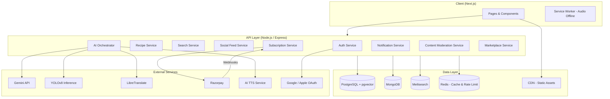
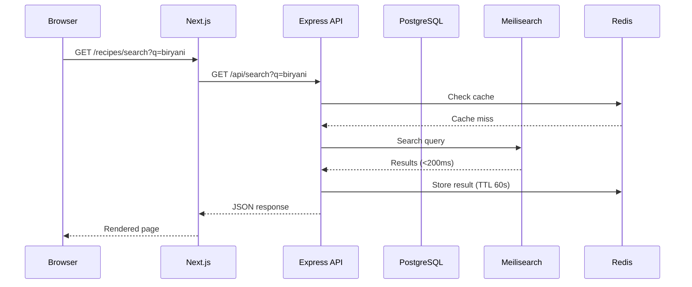
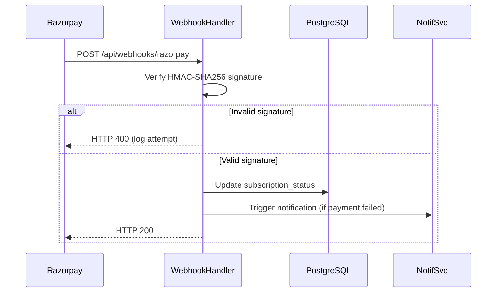

# Design Document: Global Culinary Compass

## Overview

Global Culinary Compass is a full-stack, AI-powered culinary discovery and community platform. Users explore authentic recipes from every country and region, discover local food when traveling, share family recipes, learn cooking skills, and get real-time AI help when something goes wrong in the kitchen.

The platform is web-first, built on Next.js with a Node.js/Express backend, dual databases (PostgreSQL + pgvector for structured/AI data, MongoDB for social feeds), Meilisearch for instant search, and Razorpay for subscription billing. AI features include Gemini API (Recipe Fixer), YOLOv8 (Dish Scanner), and AI voice synthesis (Audio Guides).

### Key Design Goals

- Sub-200ms search responses via Meilisearch
- Semantic recipe discovery via pgvector embeddings
- Webhook-driven subscription lifecycle (Razorpay)
- Content moderation pipeline before any UGC goes public
- Graceful degradation when AI services (Gemini, YOLOv8, LibreTranslate) are unavailable

---

## Architecture

### High-Level System Diagram



### Request Flow



---

## Components and Interfaces

### Frontend (Next.js)

The frontend uses the App Router. Pages map directly to the major feature areas.

```
app/
├── (auth)/
│   ├── login/page.tsx
│   └── register/page.tsx
├── (onboarding)/
│   └── onboarding/page.tsx
├── (app)/
│   ├── layout.tsx              # Shell with nav + paywall guard
│   ├── page.tsx                # Discovery Home
│   ├── recipes/
│   │   ├── [id]/page.tsx       # Recipe Detail
│   │   └── create/page.tsx     # Recipe Creator Studio
│   ├── map/page.tsx            # Tastes of the World Map
│   ├── feed/page.tsx           # Social Feed
│   ├── scanner/page.tsx        # Dish Scanner
│   ├── fixer/page.tsx          # AI Recipe Fixer
│   ├── academy/
│   │   ├── page.tsx            # Course list
│   │   └── [courseId]/[lessonId]/page.tsx
│   ├── marketplace/page.tsx
│   ├── profile/[userId]/page.tsx
│   └── settings/page.tsx
└── api/
    └── webhooks/razorpay/route.ts   # Webhook receiver (Next.js route handler)
```

**Key UI Components:**
- `RecipeCard` — bento-grid card with Flavor Spectrum bar, rating, region chip
- `PaywallOverlay` — glassmorphism overlay with Razorpay checkout trigger
- `AudioGuidePlayer` — floating player with play/pause/skip/repeat controls
- `WorldMap` — interactive SVG/canvas map with region tap handlers
- `DishScannerUpload` — drag-and-drop image upload with YOLOv8 result display
- `RecipeFixerChat` — chat-style interface for Gemini AI suggestions
- `SearchBar` — Meilisearch-backed instant search with autocomplete

### Backend (Node.js / Express)

Each service is a separate Express router mounted on the main app.

| Route Prefix | Service | Responsibility |
|---|---|---|
| `/api/auth` | AuthService | Registration, login, OAuth, JWT, session |
| `/api/recipes` | RecipeService | CRUD, moderation queue, translation cache |
| `/api/search` | SearchService | Meilisearch proxy, semantic search via pgvector |
| `/api/feed` | SocialService | Posts, likes, comments, follows (MongoDB) |
| `/api/ai/fixer` | AIService | Gemini API proxy, usage quota enforcement |
| `/api/ai/scanner` | AIService | YOLOv8 inference, nutrition lookup |
| `/api/ai/audio` | AIService | TTS generation, offline download |
| `/api/subscriptions` | SubscriptionService | Razorpay plan creation, status management |
| `/api/webhooks/razorpay` | SubscriptionService | Webhook signature verification + event handling |
| `/api/academy` | AcademyService | Courses, lessons, progress, badges |
| `/api/marketplace` | MarketplaceService | Listings, supplier management |
| `/api/moderation` | ModerationService | Review queue, approve/reject, reports |
| `/api/notifications` | NotificationService | In-app + email notifications |
| `/api/profile` | ProfileService | User profile, culinary passport, settings |

### Webhook Handler Detail

The Razorpay webhook endpoint is the most security-critical component.



---

## Data Models

### PostgreSQL Schema (Core Structured Data)

```sql
-- Users
CREATE TABLE users (
    id              UUID PRIMARY KEY DEFAULT gen_random_uuid(),
    email           TEXT UNIQUE NOT NULL,
    password_hash   TEXT,                        -- NULL for OAuth users
    oauth_provider  TEXT,                        -- 'google' | 'apple' | NULL
    oauth_id        TEXT,
    display_name    TEXT NOT NULL,
    avatar_url      TEXT,
    bio             TEXT,
    preferred_lang  TEXT NOT NULL DEFAULT 'en',
    is_premium      BOOLEAN NOT NULL DEFAULT FALSE,
    subscription_status TEXT NOT NULL DEFAULT 'trial',
    -- 'trial' | 'active' | 'cancelled' | 'payment_failed'
    trial_start_date TIMESTAMPTZ NOT NULL DEFAULT NOW(),
    subscription_id  TEXT,                       -- Razorpay subscription ID
    next_billing_date TIMESTAMPTZ,
    profile_visibility TEXT NOT NULL DEFAULT 'public', -- 'public' | 'private'
    created_at      TIMESTAMPTZ NOT NULL DEFAULT NOW(),
    updated_at      TIMESTAMPTZ NOT NULL DEFAULT NOW()
);

-- Recipes
CREATE TABLE recipes (
    id              UUID PRIMARY KEY DEFAULT gen_random_uuid(),
    title           TEXT NOT NULL,
    author_id       UUID REFERENCES users(id) ON DELETE SET NULL,
    region_id       UUID REFERENCES regions(id),
    ingredients     JSONB NOT NULL,              -- [{name, quantity, unit}]
    steps           JSONB NOT NULL,              -- [{order, text, image_url}]
    prep_time_mins  INTEGER,
    cook_time_mins  INTEGER,
    servings        INTEGER,
    dietary_tags    TEXT[],
    flavor_spectrum JSONB,                       -- {spicy, sweet, savory, earthy} 0-10
    cover_image_url TEXT,
    is_family_recipe BOOLEAN NOT NULL DEFAULT FALSE,
    status          TEXT NOT NULL DEFAULT 'pending',
    -- 'pending' | 'published' | 'rejected'
    rejection_reason TEXT,
    embedding       VECTOR(1536),               -- pgvector semantic embedding
    created_at      TIMESTAMPTZ NOT NULL DEFAULT NOW(),
    updated_at      TIMESTAMPTZ NOT NULL DEFAULT NOW()
);

-- Regions
CREATE TABLE regions (
    id          UUID PRIMARY KEY DEFAULT gen_random_uuid(),
    name        TEXT NOT NULL,
    country     TEXT NOT NULL,
    sub_region  TEXT,                            -- state/province
    latitude    DECIMAL,
    longitude   DECIMAL
);

-- Ratings (one per user per recipe)
CREATE TABLE ratings (
    id          UUID PRIMARY KEY DEFAULT gen_random_uuid(),
    user_id     UUID REFERENCES users(id) ON DELETE CASCADE,
    recipe_id   UUID REFERENCES recipes(id) ON DELETE CASCADE,
    value       SMALLINT NOT NULL CHECK (value BETWEEN 1 AND 5),
    created_at  TIMESTAMPTZ NOT NULL DEFAULT NOW(),
    updated_at  TIMESTAMPTZ NOT NULL DEFAULT NOW(),
    UNIQUE (user_id, recipe_id)
);

-- Translation Cache
CREATE TABLE recipe_translations (
    id          UUID PRIMARY KEY DEFAULT gen_random_uuid(),
    recipe_id   UUID REFERENCES recipes(id) ON DELETE CASCADE,
    language    TEXT NOT NULL,
    title       TEXT,
    steps       JSONB,
    ingredients JSONB,
    created_at  TIMESTAMPTZ NOT NULL DEFAULT NOW(),
    UNIQUE (recipe_id, language)
);

-- Subscription Events (audit log)
CREATE TABLE subscription_events (
    id          UUID PRIMARY KEY DEFAULT gen_random_uuid(),
    user_id     UUID REFERENCES users(id),
    event_type  TEXT NOT NULL,
    razorpay_event_id TEXT UNIQUE,
    payload     JSONB,
    processed_at TIMESTAMPTZ NOT NULL DEFAULT NOW()
);

-- AI Usage Quotas
CREATE TABLE ai_usage (
    user_id     UUID REFERENCES users(id) ON DELETE CASCADE,
    date        DATE NOT NULL DEFAULT CURRENT_DATE,
    fixer_count INTEGER NOT NULL DEFAULT 0,
    PRIMARY KEY (user_id, date)
);

-- Academy Courses & Lessons
CREATE TABLE courses (
    id          UUID PRIMARY KEY DEFAULT gen_random_uuid(),
    title       TEXT NOT NULL,
    category    TEXT NOT NULL,               -- 'cooking' | 'gardening'
    description TEXT,
    is_premium  BOOLEAN NOT NULL DEFAULT FALSE
);

CREATE TABLE lessons (
    id          UUID PRIMARY KEY DEFAULT gen_random_uuid(),
    course_id   UUID REFERENCES courses(id) ON DELETE CASCADE,
    title       TEXT NOT NULL,
    content     JSONB,
    order_index INTEGER NOT NULL,
    is_free     BOOLEAN NOT NULL DEFAULT FALSE
);

CREATE TABLE user_lesson_progress (
    user_id     UUID REFERENCES users(id) ON DELETE CASCADE,
    lesson_id   UUID REFERENCES lessons(id) ON DELETE CASCADE,
    completed   BOOLEAN NOT NULL DEFAULT FALSE,
    completed_at TIMESTAMPTZ,
    PRIMARY KEY (user_id, lesson_id)
);

-- Marketplace Listings
CREATE TABLE marketplace_listings (
    id              UUID PRIMARY KEY DEFAULT gen_random_uuid(),
    supplier_id     UUID REFERENCES users(id),
    ingredient_name TEXT NOT NULL,
    region_id       UUID REFERENCES regions(id),
    price           DECIMAL(10,2),
    unit            TEXT,
    availability    TEXT NOT NULL DEFAULT 'available',
    -- 'available' | 'out_of_stock'
    contact_url     TEXT,
    created_at      TIMESTAMPTZ NOT NULL DEFAULT NOW()
);

-- Notifications
CREATE TABLE notifications (
    id          UUID PRIMARY KEY DEFAULT gen_random_uuid(),
    user_id     UUID REFERENCES users(id) ON DELETE CASCADE,
    type        TEXT NOT NULL,
    payload     JSONB,
    is_read     BOOLEAN NOT NULL DEFAULT FALSE,
    created_at  TIMESTAMPTZ NOT NULL DEFAULT NOW()
);
```

### MongoDB Collections (Social Feed)

```javascript
// posts collection
{
  _id: ObjectId,
  author_id: String,          // UUID from PostgreSQL users table
  caption: String,            // max 500 chars
  media: [{
    type: "image" | "video",
    url: String,
    size_bytes: Number
  }],
  recipe_tags: [String],      // recipe UUIDs
  likes_count: Number,
  comments_count: Number,
  shares_count: Number,
  status: "pending" | "published" | "removed",
  created_at: Date,
  updated_at: Date
}

// comments collection
{
  _id: ObjectId,
  post_id: ObjectId,
  recipe_id: String,          // if comment is on a recipe (UUID)
  author_id: String,
  text: String,               // max 2000 chars
  video_url: String,          // optional
  status: "pending" | "published" | "removed",
  created_at: Date
}

// follows collection
{
  _id: ObjectId,
  follower_id: String,
  following_id: String,
  created_at: Date
}
```

### Meilisearch Index Schema

```json
{
  "index": "recipes",
  "primaryKey": "id",
  "searchableAttributes": [
    "title", "ingredients_flat", "region_name", "dietary_tags", "description"
  ],
  "filterableAttributes": [
    "region_id", "dietary_tags", "prep_time_mins", "cook_time_mins", "status"
  ],
  "sortableAttributes": ["average_rating", "created_at"],
  "typoTolerance": {
    "enabled": true,
    "minWordSizeForTypos": { "oneTypo": 5, "twoTypos": 9 }
  }
}
```

---

## Correctness Properties

*A property is a characteristic or behavior that should hold true across all valid executions of a system — essentially, a formal statement about what the system should do. Properties serve as the bridge between human-readable specifications and machine-verifiable correctness guarantees.*


### Property 1: Trial Initiation on Registration

*For any* user who completes registration, the database record should have `subscription_status = "trial"` and `trial_start_date` set to the current timestamp.

**Validates: Requirements 1.2, 13.1**

---

### Property 2: Onboarding Preferences Round Trip

*For any* set of dietary preferences, cuisine interests, and preferred language submitted during onboarding, fetching the user's profile should return those exact preferences.

**Validates: Requirements 1.4**

---

### Property 3: Duplicate Email Rejection

*For any* email address already registered in the system, attempting to register again with that email should return an error and leave the total user count unchanged.

**Validates: Requirements 1.5**

---

### Property 4: Recipe Required Fields Invariant

*For any* recipe stored in the database, all required fields (title, region_id, ingredients with at least 3 items, steps with at least 2 items, cover_image_url) must be non-null and non-empty.

**Validates: Requirements 2.1, 4.1**

---

### Property 5: Recipe Dietary Tags Validity

*For any* recipe, every value in `dietary_tags` must belong to the allowed set: {vegan, vegetarian, gluten-free, dairy-free, nut-free, diabetic-friendly, halal}.

**Validates: Requirements 2.6**

---

### Property 6: Translation Cache Round Trip

*For any* recipe and any supported language, requesting the recipe in that language twice should return identical content, and the second request should be served from the translation cache (no new LibreTranslate API call).

**Validates: Requirements 2.3, 14.2, 14.3**

---

### Property 7: Moderation Queue Invariant

*For any* user-generated content item (recipe, comment, or social feed post), it must never be publicly visible while its `status` is `"pending"`. All submitted UGC must transition through `"pending"` before reaching `"published"`.

**Validates: Requirements 4.3, 6.5, 7.7, 15.1**

---

### Property 8: Moderation State Transitions

*For any* content item approved by the Content_Moderator, its `status` must be `"published"` and a notification must exist for the author. For any content item rejected, its `status` must be `"rejected"`, `rejection_reason` must be non-null, and a notification must exist for the author.

**Validates: Requirements 4.4, 4.5, 15.6**

---

### Property 9: Recipe Ownership Authorization

*For any* user, they should be able to edit or delete their own recipes (where `author_id` matches their user ID), and must receive a 403 error when attempting to edit or delete another user's recipe.

**Validates: Requirements 4.7**

---

### Property 10: Search Response Time

*For any* query string of up to 200 characters submitted to the Search_Engine, the response must arrive within 200ms.

**Validates: Requirements 5.1**

---

### Property 11: Typo-Tolerant Search

*For any* published recipe title, a search query with up to 2 character substitutions, insertions, or deletions should still return that recipe in the results.

**Validates: Requirements 5.2**

---

### Property 12: Search Filter Correctness

*For any* search query with one or more filters applied (Region, dietary tag, prep time, ingredient, rating), every result in the response must satisfy all applied filters.

**Validates: Requirements 5.3**

---

### Property 13: Autocomplete Threshold

*For any* input string of length >= 2 typed into the search bar, the autocomplete endpoint must return at least one suggestion (when matching recipes exist).

**Validates: Requirements 5.5**

---

### Property 14: Rating Upsert (One Rating Per User Per Recipe)

*For any* user and recipe pair, submitting multiple ratings should result in exactly one rating row in the database, with the value equal to the most recently submitted rating.

**Validates: Requirements 6.1, 6.7**

---

### Property 15: Average Rating Computation

*For any* recipe with N ratings, the displayed average rating must equal the arithmetic mean of all stored rating values, rounded to one decimal place.

**Validates: Requirements 6.2**

---

### Property 16: Comment Ordering

*For any* list of comments on a recipe or post, the comments must be sorted by `created_at` in descending order (most recent first).

**Validates: Requirements 6.4**

---

### Property 17: Social Feed Follows Filter

*For any* user, their social feed must contain only posts from users they follow, sorted by `created_at` descending.

**Validates: Requirements 7.1**

---

### Property 18: Follow/Unfollow Round Trip

*For any* user A following user B, unfollowing user B should result in user B's posts no longer appearing in user A's feed, and the follow relationship should not exist in the database.

**Validates: Requirements 7.4**

---

### Property 19: Discover Feed Ranking

*For any* set of posts in the Discover tab, they must be ordered by engagement score (likes_count + comments_count + shares_count) descending, and all posts must have `created_at` within the past 7 days.

**Validates: Requirements 7.6**

---

### Property 20: Recipe Fixer Response Quality

*For any* valid problem description (non-empty, up to 1000 characters), the Recipe_Fixer must return a response containing at least 3 distinct actionable suggestions.

**Validates: Requirements 8.1**

---

### Property 21: Recipe Fixer Quota Enforcement

*For any* free-tier or trial user, the 6th Recipe_Fixer query within a single calendar day must be rejected with a quota-exceeded error. For any premium user, no query should ever be rejected due to quota.

**Validates: Requirements 8.4, 8.5**

---

### Property 22: Dish Scanner Response Completeness

*For any* valid image (JPEG/PNG/WEBP, <= 10MB) submitted to the Dish_Scanner, if the model confidence is >= 60%, the response must include dish name, estimated region of origin, and nutritional breakdown (calories, protein, carbohydrates, fat).

**Validates: Requirements 9.1**

---

### Property 23: Dish Scanner Low-Confidence Handling

*For any* image where the YOLOv8 model returns confidence < 60%, the response must indicate identification failure and must not return nutritional data as if the dish were identified.

**Validates: Requirements 9.3**

---

### Property 24: Audio Guide Language Matching

*For any* user with a preferred language set, the Audio_Guide generated for any recipe must be in that preferred language.

**Validates: Requirements 10.3**

---

### Property 25: Audio Guide Premium Gate

*For any* premium user, downloading an Audio_Guide must succeed. For any free-tier or trial user, the download endpoint must return a 403 error.

**Validates: Requirements 10.4**

---

### Property 26: Course Lesson Ordering Invariant

*For any* course, the lessons must have unique, sequential `order_index` values starting from 1 with no gaps.

**Validates: Requirements 11.1**

---

### Property 27: Course Progress Computation

*For any* user and course, the displayed progress percentage must equal `(completed_lessons / total_lessons) * 100`, rounded to the nearest integer.

**Validates: Requirements 11.2**

---

### Property 28: Badge Award on Course Completion

*For any* user who completes all lessons in a course (progress = 100%), a completion badge for that course must be created and visible on their profile.

**Validates: Requirements 11.4**

---

### Property 29: Academy Access Control

*For any* premium user, all lessons in all courses must be accessible. For any free-tier user, only the lesson with `order_index = 1` in each course must be accessible; all other lessons must return a 403 error.

**Validates: Requirements 11.6, 11.7**

---

### Property 30: Marketplace Listing Completeness

*For any* marketplace listing, all required fields (supplier name, ingredient name, region of origin, price, unit, availability status) must be non-null.

**Validates: Requirements 12.1**

---

### Property 31: Marketplace Filter Correctness

*For any* marketplace query with filters applied (Region, ingredient category, availability), every returned listing must satisfy all applied filters.

**Validates: Requirements 12.5**

---

### Property 32: Out-of-Stock Listing Behavior

*For any* marketplace listing with `availability = "out_of_stock"`, the order action must be disabled in the response/rendered UI, and the listing must display an "Out of Stock" indicator.

**Validates: Requirements 12.6**

---

### Property 33: Webhook Signature Verification

*For any* incoming Razorpay webhook request, the HMAC-SHA256 signature must be verified before any database state change occurs. Any request with an invalid or missing signature must receive HTTP 400 and generate a log entry.

**Validates: Requirements 13.8, 13.9, 19.5**

---

### Property 34: Webhook Subscription State Transitions

*For any* valid `subscription.activated` webhook, the user's `subscription_status` must become `"active"` and `is_premium` must become `true`. For any valid `subscription.cancelled` or `payment.failed` webhook, `is_premium` must become `false` and `subscription_status` must reflect the event type.

**Validates: Requirements 13.5, 13.6, 13.7**

---

### Property 35: Paywall Enforcement After Trial Expiry

*For any* user whose `trial_start_date` is more than 30 days ago and whose `subscription_status` is not `"active"`, all premium feature endpoints must return a 402 (Payment Required) response.

**Validates: Requirements 13.2**

---

### Property 36: Notification Preference Filtering

*For any* user who has disabled a specific notification category, no notifications of that category must be created for that user after the preference is saved.

**Validates: Requirements 17.2**

---

### Property 37: Payment Failure Dual Notification

*For any* `payment.failed` webhook event, both an in-app notification record and an email notification must be created within 5 minutes of the webhook being received.

**Validates: Requirements 17.3**

---

### Property 38: Pagination Size Invariant

*For any* paginated list endpoint in the API, the number of items in a single page response must never exceed 20.

**Validates: Requirements 18.3**

---

### Property 39: Password Hashing Security

*For any* user account created with email/password, the stored `password_hash` must be a valid bcrypt hash with a cost factor of at least 12.

**Validates: Requirements 19.1**

---

### Property 40: Authentication Rate Limiting

*For any* IP address, after 10 consecutive failed login attempts within a 15-minute window, the 11th attempt must be rejected with HTTP 429 before the credentials are checked.

**Validates: Requirements 19.3**

---

### Property 41: Input Sanitization

*For any* user-supplied input containing SQL injection patterns or XSS payloads, the value stored in the database must be the sanitized/escaped version, and the raw payload must never be executed.

**Validates: Requirements 19.4**

---

### Property 42: Private Profile Access Control

*For any* user with `profile_visibility = "private"`, requests from unauthenticated users or users who are not approved followers must receive a 403 response for profile content endpoints.

**Validates: Requirements 16.4**

---

### Property 43: Culinary Passport Accuracy

*For any* user, the set of regions displayed in their Culinary Passport must be exactly the set of distinct regions from recipes they have saved or marked as cooked — no more, no less.

**Validates: Requirements 16.5**

---

### Property 44: Automated Content Pre-Screening

*For any* submitted content item containing a prohibited keyword or explicit imagery marker, the item must be flagged and placed in the manual review queue before any human review step.

**Validates: Requirements 15.2, 15.3**

---

## Error Handling

### Strategy

All errors follow a consistent JSON envelope:

```json
{
  "error": {
    "code": "RECIPE_NOT_FOUND",
    "message": "The requested recipe does not exist.",
    "retryable": false
  }
}
```

### Service Degradation Matrix

| Service | Failure Mode | Fallback Behavior |
|---|---|---|
| Gemini API | Timeout / 5xx | Return error with retry prompt; do not decrement quota |
| YOLOv8 | Timeout / model error | Return "Could not identify dish" with manual search option |
| LibreTranslate | Unavailable | Serve content in English; display "Translation temporarily unavailable" banner |
| Meilisearch | Unavailable | Fall back to PostgreSQL ILIKE search; log degradation |
| Razorpay | Webhook delivery failure | Razorpay retries automatically; idempotency key on subscription_events prevents duplicate processing |
| MongoDB | Unavailable | Social feed endpoints return 503; core recipe browsing unaffected |
| Redis | Unavailable | Bypass cache; serve directly from DB; log cache miss spike |

### HTTP Status Code Conventions

| Scenario | Status Code |
|---|---|
| Unauthenticated request to protected route | 401 |
| Authenticated but insufficient permissions | 403 |
| Premium feature accessed without subscription | 402 |
| Resource not found | 404 |
| Validation error (missing/invalid fields) | 422 |
| Rate limit exceeded | 429 |
| Upstream AI service error | 502 |
| Planned maintenance / service unavailable | 503 |

### Webhook Idempotency

The `subscription_events` table has a `UNIQUE` constraint on `razorpay_event_id`. Any duplicate webhook delivery is silently ignored after the first successful processing, returning HTTP 200 to Razorpay to prevent retry loops.

---

## Testing Strategy

### Dual Testing Approach

Both unit tests and property-based tests are required. They are complementary:

- **Unit tests** verify specific examples, integration points, and error conditions
- **Property-based tests** verify universal properties across randomly generated inputs

### Property-Based Testing

**Library choices by layer:**

| Layer | Language | PBT Library |
|---|---|---|
| Backend (Node.js) | TypeScript | `fast-check` |
| Frontend (Next.js) | TypeScript | `fast-check` |

Each property-based test must:
- Run a minimum of **100 iterations**
- Include a comment tag referencing the design property:
  ```
  // Feature: global-culinary-compass, Property N: <property_text>
  ```
- Be implemented as a **single** property-based test per design property

**Example test structure (fast-check):**

```typescript
import * as fc from 'fast-check';

// Feature: global-culinary-compass, Property 14: Rating Upsert
test('one rating per user per recipe (upsert)', async () => {
  await fc.assert(
    fc.asyncProperty(
      fc.uuid(),           // userId
      fc.uuid(),           // recipeId
      fc.array(fc.integer({ min: 1, max: 5 }), { minLength: 2, maxLength: 10 }),
      async (userId, recipeId, ratings) => {
        for (const value of ratings) {
          await submitRating(userId, recipeId, value);
        }
        const stored = await getRatings(userId, recipeId);
        expect(stored).toHaveLength(1);
        expect(stored[0].value).toBe(ratings[ratings.length - 1]);
      }
    ),
    { numRuns: 100 }
  );
});
```

### Unit Testing

Unit tests focus on:
- Specific examples that demonstrate correct behavior (e.g., OAuth redirect URLs configured)
- Integration points between components (e.g., Razorpay checkout flow initiation)
- Edge cases and error conditions (e.g., Gemini API timeout handling, LibreTranslate fallback)

Avoid writing unit tests for behaviors already covered by property tests. Unit tests should cover the "yes - example" criteria from the prework analysis.

**Key unit test areas:**
- Auth: OAuth provider configuration, JWT expiry redirect with URL preservation
- Recipe: Creator Studio rendering, Family Recipe badge display
- Dish Scanner: Disclaimer text presence, manual search fallback UI
- Audio Guide: Playback controls rendering, offline download retry UI
- Subscription: Razorpay checkout initiation, profile page subscription status display
- Marketplace: "Find Ingredients" shortcut filter, supplier contact display
- Moderation: User report submission flow

### Test Organization

```
tests/
├── unit/
│   ├── auth/
│   ├── recipes/
│   ├── social/
│   ├── ai/
│   ├── subscriptions/
│   └── moderation/
├── property/
│   ├── auth.property.test.ts
│   ├── recipes.property.test.ts
│   ├── search.property.test.ts
│   ├── ratings.property.test.ts
│   ├── social.property.test.ts
│   ├── ai.property.test.ts
│   ├── subscriptions.property.test.ts
│   ├── academy.property.test.ts
│   ├── marketplace.property.test.ts
│   ├── moderation.property.test.ts
│   ├── notifications.property.test.ts
│   └── security.property.test.ts
└── integration/
    ├── razorpay-webhook.test.ts
    ├── meilisearch-sync.test.ts
    └── libretranslate-fallback.test.ts
```
